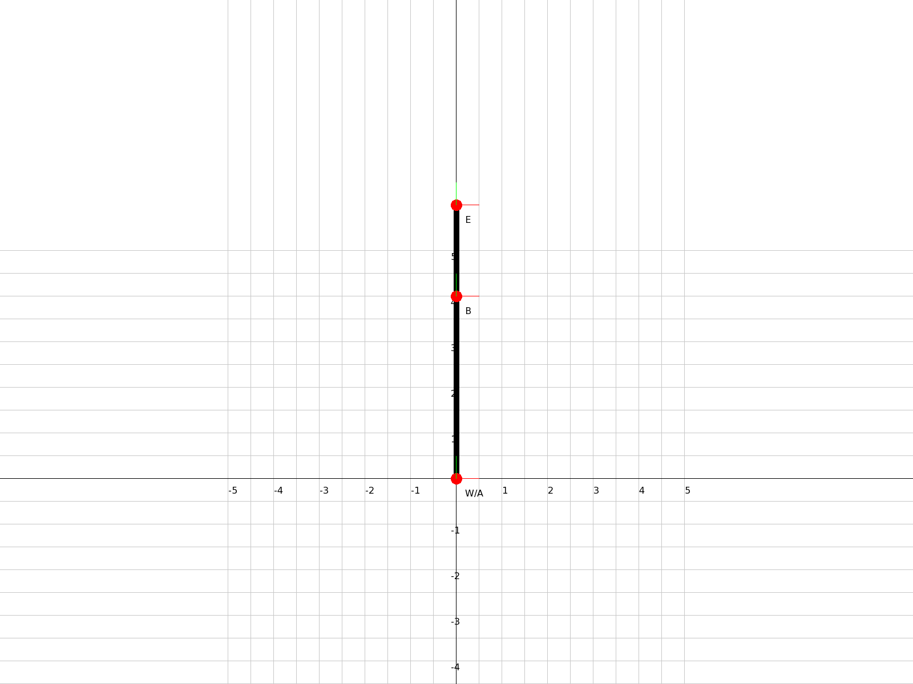
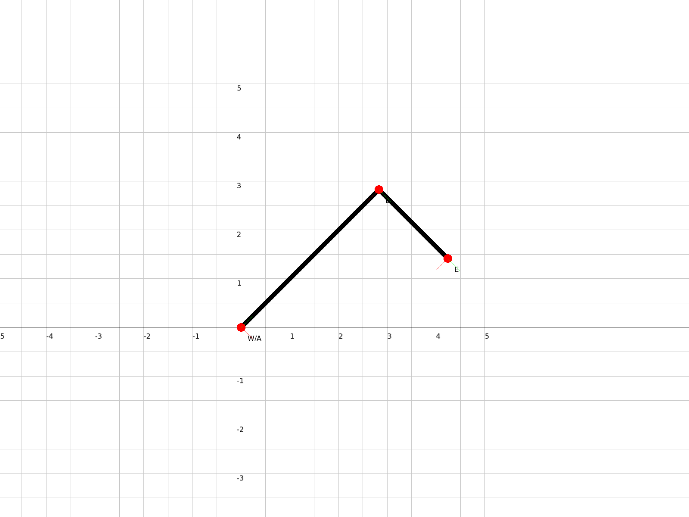
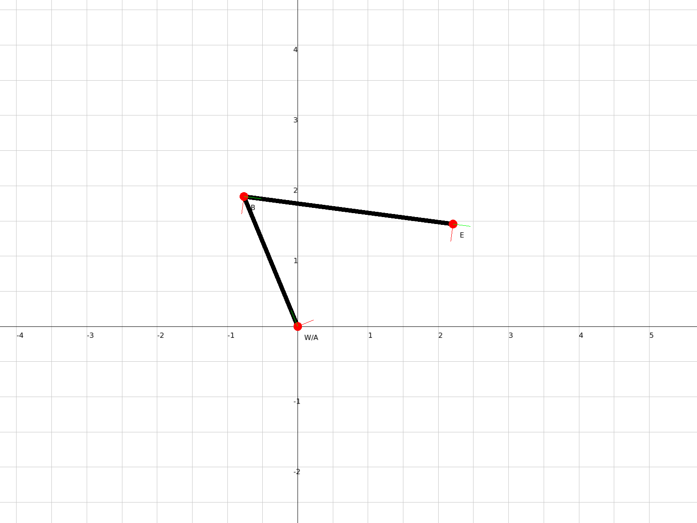

# Robot Arm Visualization

This project provides a 2D visualization of a two-link planar robot arm using C++ and SFML. It calculates the forward kinematics of the robot arm and displays it in a graphical window.

## Features

- Visualization of a two-link planar robot arm
- Dynamic scaling to fit the robot arm in the window
- Display of joint angles and coordinate frames
- Grid background for easy measurement
- Ability to save the visualization as an image

## Requirements

- C++17 or later
- CMake 3.10 or later
- SFML 2.5 or later
- Eigen 3.3 or later

## Installation

### Ubuntu/Debian

1. Install the required packages:

   ```bash
   sudo apt-get update
   sudo apt-get install build-essential cmake libsfml-dev libeigen3-dev
   ```

2. Clone the repository:

   ```bash
   git clone https://github.com/yourusername/robot-arm-visualization.git
   cd robot-arm-visualization
   ```

3. Create a build directory and compile the project:

   ```bash
   mkdir build && cd build
   cmake ..
   make
   ```

### macOS

1. Install Homebrew if you haven't already:

   ```bash
   /bin/bash -c "$(curl -fsSL https://raw.githubusercontent.com/Homebrew/install/HEAD/install.sh)"
   ```

2. Install the required packages:

   ```bash
   brew install cmake sfml eigen
   ```

3. Clone the repository and compile the project (same as steps 2-3 for Ubuntu/Debian).

### Windows

1. Install [MSYS2](https://www.msys2.org/) and open the MSYS2 MinGW 64-bit terminal.

2. Install the required packages:

   ```bash
   pacman -S mingw-w64-x86_64-gcc mingw-w64-x86_64-cmake mingw-w64-x86_64-sfml mingw-w64-x86_64-eigen3
   ```

3. Clone the repository and compile the project (same as steps 2-3 for Ubuntu/Debian).

## Usage

After compiling the project, you can run the executable:

```bash
./robot_arm_visualization
```

This will generate three PNG images in the `robot_configurations` directory, each representing a different robot arm configuration.

## Robot Configurations

The project includes visualizations for three specific robot arm configurations:

### Configuration 2a

- Joint angles: [0, 0]
- Link lengths: [4.0, 2.0]



### Configuration 2b

- Joint angles: [-π/4, -π/2]
- Link lengths: [4.0, 2.0]



### Configuration 2c

- Joint angles: [π/8, -2π/3]
- Link lengths: [2.0, 3.0]



## Project Structure

- `include/robot_arm.h`: Header file for the RobotArm class
- `include/visualizer.h`: Header file for the Visualizer class
- `src/robot_arm.cpp`: Implementation of the RobotArm class
- `src/visualizer.cpp`: Implementation of the Visualizer class
- `src/main.cpp`: Main program that sets up the robot arm and runs the visualization
- `CMakeLists.txt`: CMake configuration file
- `robot_configurations/`: Directory containing the generated configuration images

## Contributing

Contributions are welcome! Please feel free to submit a Pull Request.

## License

This project is open source and available under the [MIT License](LICENSE).